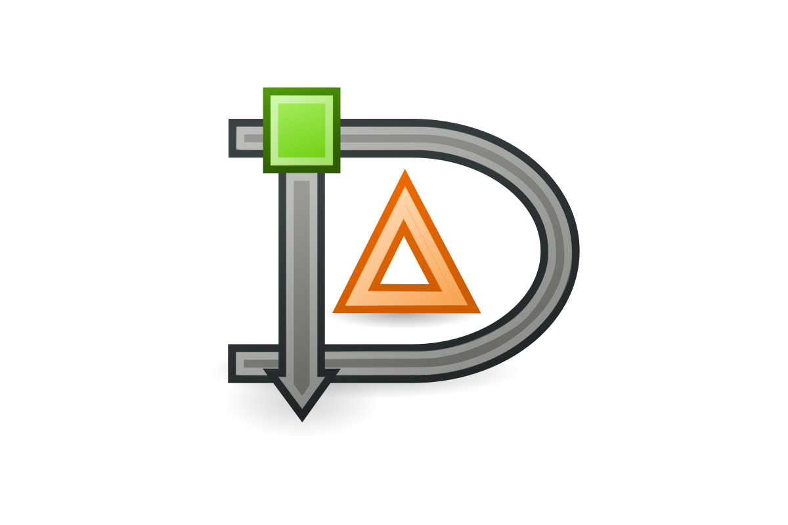

<a name="readme-top"></a>
[![Contributors][contributors-shield]][contributors-url]
[![Forks][forks-shield]][forks-url]
[![Stargazers][stars-shield]][stars-url]
[![Issues][issues-shield]][issues-url]
[![GNU License][license-shield]][license-url]
[![LinkedIn][linkedin-shield]][linkedin-url]

<!-- PROJECT LOGO -->
<br />
<div align="center">
  <a href="https://github.com/FalconEthics/DIA">
    
  </a>

<h3 align="center">DIA: Duplicate Image Analyzer</h3>

  <p align="center">
    Efficiently find and delete duplicate images from your directories with blazing speed and precision.
    <br />
    <a href="https://github.com/FalconEthics/DIA/releases/latest"><strong>Download Latest Release »</strong></a>
    <br />
    <br />
    <a href="https://github.com/FalconEthics/DIA/issues">Report Bug</a>
    ·
    <a href="https://github.com/FalconEthics/DIA/issues">Request Feature</a>
  </p>
</div>

## About The Project

[![DIA Screenshot][product-screenshot]](./demo/Screenshot.png)

DIA is a fast, command-line tool written in C for scanning directories and removing duplicate images. It uses
cryptographic hashing (MD5 or SHA256) to ensure high-precision duplicate detection, even across different file formats.
DIA is ideal for photographers, designers, and anyone managing large image collections.

### Key Features

- **High Precision**: Detects duplicates by content, not just filename or extension.
- **Fast & Lightweight**: Written in C for maximum performance.
- **Flexible**: Supports recursive scan, dry-run, logging, SHA256/MD5, and interactive deletion.
- **Cross-Platform**: Works on Linux, macOS, and Windows (via WSL or MinGW).

---

## Getting Started

### Prerequisites

- **Linux/macOS**: GCC, OpenSSL development libraries
- **Windows**: MinGW or WSL, OpenSSL

### Build Instructions

#### Linux/macOS

1. **Install dependencies** (if not already):
   ```sh
   # Ubuntu/Debian
   sudo apt-get install build-essential libssl-dev
   # macOS (with Homebrew)
   brew install openssl
   ```
2. **Clone the repo**
   ```sh
   git clone https://github.com/FalconEthics/DIA.git
   cd DIA
   ```
3. **Build with Makefile**
   ```sh
   make
   # or manually:
   gcc -o dia dia.c -lcrypto
   ```

#### Windows (WSL or MinGW)

- **WSL**: Follow Linux steps above inside your WSL terminal.
- **MinGW**: Install OpenSSL and build with:
   ```sh
   gcc -o dia.exe dia.c -lcrypto
   ```

---

## Usage

```sh
./dia [-r] [--dry-run] [--log logfile] [--sha256] [--interactive] <directory>
```

**Options:**

- `-r` : Recursively scan directories
- `--dry-run` : Show duplicates without deleting
- `--log FILE` : Log output to FILE
- `--sha256` : Use SHA256 instead of MD5
- `--interactive` : Prompt before each deletion

**Example:**

```sh
./dia -r --interactive --log deleted.txt ./demo
```

---

## Caution

- **Permanent Deletion**: Duplicates are deleted permanently. Backup your data first!
- **Permissions**: Ensure you have permission to delete files in the target directory.
- **Hash Collisions**: Extremely rare, but possible with MD5. Use `--sha256` for extra safety.

---

## Contributing

Contributions are welcome! Please fork the repo and submit a pull request. For major changes, open an issue first to
discuss what you would like to change.

---

## License

Distributed under the GNU License. See [`LICENSE`](./LICENSE) for more information.

## Contact

[![LinkedIn][linkedin-badge]][linkedin-url]
[![Portfolio][portfolio-badge]][portfolio-url]
[![Gmail][gmail-badge]][gmail-url]

Soumik Das - [mrsoumikdas.com](https://mrsoumikdas.com/)

Project Link: [https://github.com/FalconEthics/DIA](https://github.com/FalconEthics/DIA)

Latest Release: [Download Here](https://github.com/FalconEthics/DIA/releases/latest)

<!-- MARKDOWN LINKS & IMAGES -->

[contributors-shield]: https://img.shields.io/github/contributors/FalconEthics/DIA.svg?style=for-the-badge

[contributors-url]: https://github.com/FalconEthics/DIA/graphs/contributors

[forks-shield]: https://img.shields.io/github/forks/FalconEthics/DIA.svg?style=for-the-badge

[forks-url]: https://github.com/FalconEthics/DIA/network/members

[stars-shield]: https://img.shields.io/github/stars/FalconEthics/DIA.svg?style=for-the-badge

[stars-url]: https://github.com/FalconEthics/DIA/stargazers

[issues-shield]: https://img.shields.io/github/issues/FalconEthics/DIA.svg?style=for-the-badge

[issues-url]: https://github.com/FalconEthics/DIA/issues

[license-shield]: https://img.shields.io/github/license/FalconEthics/DIA.svg?style=for-the-badge

[license-url]: https://github.com/FalconEthics/DIA/blob/main/LICENSE

[linkedin-shield]: https://img.shields.io/badge/-LinkedIn-black.svg?style=for-the-badge&logo=linkedin&colorB=555

[linkedin-url]: https://www.linkedin.com/in/soumik-das-profile/

[product-screenshot]: ./demo/Screenshot.png

[linkedin-badge]: https://img.shields.io/badge/LinkedIn-0077B5?style=for-the-badge&logo=linkedin&logoColor=white

[linkedin-url]: https://www.linkedin.com/in/soumik-das-profile/

[portfolio-badge]: https://img.shields.io/badge/Portfolio-255E63?style=for-the-badge&logo=About.me&logoColor=white

[portfolio-url]: https://mrsoumikdas.com/

[gmail-badge]: https://img.shields.io/badge/Gmail-D14836?style=for-the-badge&logo=gmail&logoColor=white

[gmail-url]: mailto:mail2soumikdas@gmail.com